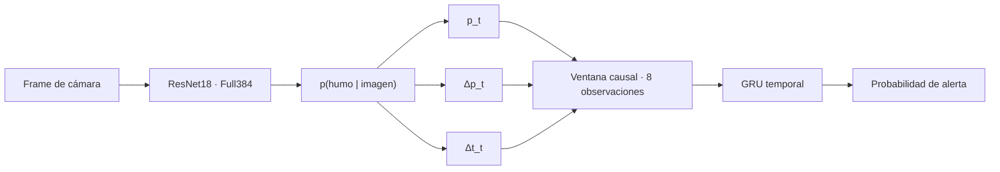

# FIgLib Smoke Detection — ResNet18 + Temporal GRU

Bloque de visión artificial y detección temporal desarrollado por **Antón Soto** como parte de **VIGÍA**, el sistema multimodal del Trabajo Fin de Máster **Sistema multimodal para la detección temprana de incendios forestales mediante inteligencia artificial** (UCM, 2025–2026).

Este repositorio corresponde específicamente al módulo **FIgLib/HPWREN** de VIGÍA: clasificación visual de humo y detección temporal temprana sobre cámaras fijas. No representa por sí solo el sistema multimodal completo.

El objetivo de este repositorio es estudiar dos preguntas concretas sobre cámaras fijas de vigilancia:

1. **¿Cuánta información visual se pierde al reducir la resolución de entrada?**
2. **¿Puede la evolución temporal de la probabilidad de humo mejorar una alerta basada en frames independientes?**

El trabajo se desarrolla sobre **FIgLib/HPWREN**, con particionado a nivel de evento para evitar fuga de información entre entrenamiento, validación y test.


## Trabajo Fin de Máster completo

Este repositorio documenta principalmente el módulo **FIgLib/HPWREN** desarrollado por **Antón Soto Martínez** dentro de VIGÍA. La memoria completa corresponde al trabajo conjunto del equipo del TFM.

- 📄 [Memoria completa](thesis/Memoria.pdf)
- [Anexo A](thesis/Anexos/Anexo_A.pdf)
- [Anexo B — Repositorios y código](thesis/Anexos/Anexo_B_repositorios.pdf)
- [Anexo C](thesis/Anexos/Anexo_C.pdf)
- [Anexo D — FIgLib/HPWREN](thesis/Anexos/Anexo_D_FIgLib.pdf)
- [Anexo E — Documentación MITECO](thesis/Anexos/Anexo_E_MITECO.pdf)
- [Paquete completo de entrega](thesis/Grupo1_Deteccion_Incendios.zip)

**Autores del TFM:** Daniel Bravo Quintián, Alejandro Carrasco Ordejón, Pablo Medina de la Iglesia, Juan Peñas Utrilla, Antón Soto Martínez y Adrián Tomás Alonso.

Universidad Complutense de Madrid — Máster en Big Data, Data Science e Inteligencia Artificial, 2025–2026.

## Resultados principales

### Clasificación visual

| Modelo | Balanced Accuracy | Precision | Recall | AUC | FPR | Falsos positivos |
|---|---:|---:|---:|---:|---:|---:|
| Full224 | 0.7450 | 0.8220 | 0.6689 | 0.7988 | 0.1788 | 301 |
| **Full384** | **0.7989** | **0.9019** | **0.6906** | **0.8386** | **0.0927** | **156** |

El aumento de resolución de 224×224 a 384×384 redujo los falsos positivos de **301 a 156** en el conjunto de test. La comparación se validó mediante bootstrap pareado por evento con 10 000 réplicas.

### Detección temporal

| Métrica | Media móvil (5) | GRU |
|---|---:|---:|
| Detección post-`t=0` | 0.88 | **0.96** |
| ≤ 5 min | 0.36 | **0.56** |
| ≤ 10 min | 0.58 | **0.72** |
| ≤ 15 min | 0.72 | **0.90** |
| ≤ 30 min | 0.88 | **0.94** |
| Mediana hasta primera alerta | 361 s | **210.5 s** |
| Eventos no detectados | 6 | **2** |

La GRU mejora cobertura y rapidez de detección, a costa de una mayor sensibilidad pre-evento (`0.18 → 0.28`). Este compromiso se controla mediante el umbral de decisión.

## Arquitectura



La **ResNet18** clasifica cada frame de forma independiente. La **GRU** incorpora la evolución reciente de la señal visual para transformar predicciones aisladas en evidencia temporal de alerta.

## Dataset y particionado

FIgLib/HPWREN está organizado en secuencias asociadas a eventos. En los experimentos se trabajó con aproximadamente **41 187 imágenes físicas**, de las cuales **23 480** se utilizaron en el entrenamiento supervisado visual.

La separación entre entrenamiento, validación y test se realizó **a nivel de evento**, de forma que ningún incendio aporta frames a más de un subconjunto.

Etiquetado visual:

- negativo: `t <= -1200 s`;
- positivo: `t >= +900 s`;
- región intermedia: excluida del entrenamiento visual supervisado.

Para el modelo temporal, la etiqueta positiva se define desde `t >= 0 s`.

> `t=0` es una referencia temporal del evento y no debe interpretarse como el instante físico exacto de ignición.

## Estructura del repositorio

```text
TFM-FIgLib/
├── notebooks/
│   ├── 01_full384_visual_training.ipynb
│   ├── 02_temporal_gru_training.ipynb
│   ├── 03_paired_bootstrap_224_vs_384.ipynb
│   └── comparacion_figlib_224_vs_384.ipynb
├── src/
│   ├── visual_model.py
│   ├── temporal_gru.py
│   └── preprocessing.py
├── scripts/
│   ├── predict_visual.py
│   └── predict_temporal.py
├── training/
│   ├── train_visual_reference.py
│   └── train_temporal_reference.py
├── models/
│   ├── best_temporal_gru_full384_38.pt
│   └── README.md
├── results/
│   └── key_metrics.json
├── sample_data/
│   ├── example_probabilities.csv
│   └── README.md
├── docs/
│   └── reproducibility.md
├── thesis/
│   ├── Memoria.pdf
│   ├── Grupo1_Deteccion_Incendios.zip
│   └── Anexos/
│       ├── Anexo_A.pdf
│       ├── Anexo_B_repositorios.pdf
│       ├── Anexo_C.pdf
│       ├── Anexo_D_FIgLib.pdf
│       └── Anexo_E_MITECO.pdf
├── requirements.txt
└── README.md
```

## Modelo visual Full384

Arquitectura: **ResNet18** con entrada 384×384.

Preprocesado de evaluación:

```text
Resize(440) -> CenterCrop(384) -> ToTensor() -> ImageNet normalization
```

El checkpoint visual final (`best_resnet18_full_511_384_controlled.pt`) ocupa aproximadamente 44.8 MB y se mantiene en Google Drive:

**Checkpoint Full384:** https://drive.google.com/file/d/1_8itlXVmfy9Htq8BqSTipIAhSl4rKMRI/view

## Modelo temporal GRU

Cada observación contiene:

```text
p_t, delta_p_t, delta_t
```

Configuración del checkpoint:

- `input_size = 3`;
- `hidden_size = 32`;
- una capa GRU;
- cabeza `32 -> 16 -> 1`;
- ReLU + Dropout(0.2);
- ventana causal de 8 observaciones;
- umbral seleccionado en validación: `0.85`.

El checkpoint temporal se incluye en `models/best_temporal_gru_full384_38.pt`.

## Instalación

```bash
git clone https://github.com/Antonsoto03/TFM-FIgLib.git
cd TFM-FIgLib

python -m venv .venv
source .venv/bin/activate   # Linux/macOS
# .venv\Scripts\activate  # Windows

pip install -r requirements.txt
```

## Inferencia

### Clasificador visual

```bash
python scripts/predict_visual.py \
  --image ruta/a/imagen.jpg \
  --checkpoint models/best_resnet18_full_511_384_controlled.pt
```

### Modelo temporal

```bash
python scripts/predict_temporal.py \
  --csv sample_data/example_probabilities.csv \
  --checkpoint models/best_temporal_gru_full384_38.pt
```

El CSV de ejemplo contiene `p_smoke` y `feat_dt` ya normalizado. Si se parte únicamente de timestamps, debe utilizarse el mismo factor de normalización temporal del experimento original; el checkpoint no serializa ese valor.

## Entrenamiento y reproducibilidad

La carpeta `training/` contiene implementaciones de referencia basadas en la configuración experimental documentada en el TFM. Los experimentos históricos se ejecutaron principalmente en Google Colab y Google Drive, por lo que no todos los notebooks intermedios se conservan como artefactos autocontenidos.

El repositorio conserva:

- código de inferencia;
- arquitectura visual y temporal;
- checkpoint temporal;
- referencia al checkpoint visual;
- métricas exportadas;
- notebooks reproducibles de entrenamiento visual, entrenamiento temporal y bootstrap pareado;
- notebook de comparación de resolución;
- datos de ejemplo para comprobar el formato de entrada.

Los notebooks reproducibles se han reconstruido a partir de la configuración final documentada y de los artefactos conservados de los experimentos. No se presentan como los notebooks históricos originales de Colab.

La documentación metodológica completa y las limitaciones de reproducción están en [`docs/reproducibility.md`](docs/reproducibility.md).

## Limitaciones

- FIgLib es un benchmark basado en eventos y no equivale a una vigilancia continua 24/7.
- Una FPR por frame no debe interpretarse directamente como falsas alarmas por cámara y día.
- El rendimiento puede degradarse en cámaras, paisajes o condiciones meteorológicas distintas a las del dataset.
- El factor exacto de normalización de `feat_dt` no está serializado en el checkpoint temporal original.

## Referencias

- Dewangan, A. et al. (2022). *FIgLib & SmokeyNet: Dataset and Deep Learning Model for Real-Time Wildland Fire Smoke Detection*. Remote Sensing, 14(4), 1007. https://doi.org/10.3390/rs14041007
- Cho, K. et al. (2014). *Learning Phrase Representations using RNN Encoder--Decoder for Statistical Machine Translation*. https://doi.org/10.3115/v1/D14-1179

## Licencia y autoría

La licencia **MIT** de este repositorio se aplica al **código fuente desarrollado y publicado en este repositorio**. La memoria del TFM, sus anexos, documentación de terceros, datasets y otros materiales externos conservan su propia autoría y sus condiciones de uso originales; no quedan relicenciados automáticamente por la licencia del software. Consulta [`LICENSE`](LICENSE).

### Autor de este módulo

**Antón Soto Martínez**  
Módulo FIgLib/HPWREN — clasificación visual de humo y detección temporal temprana.  
Máster en Big Data, Data Science e Inteligencia Artificial — Universidad Complutense de Madrid.

El TFM completo es un trabajo conjunto de los seis autores indicados en la memoria.
